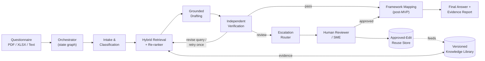

# 01 — Architecture

Status: living document. Source: `report/main.tex` §V.C–V.D, Fig. `fig:architecture`.

## Pipeline shape

Trustilo is a per-question directed graph with exactly one feedback
edge (verification may request a single retrieval retry). It is not a
free-form agent loop — every stage has a fixed input/output contract
(see `specs/02-data-model.md`) so each stage is independently testable
and swappable (NFR7).



## Agent responsibilities

| Agent | Responsibility | Owning spec |
|---|---|---|
| Orchestrator | Per-question state, retries, config/version IDs, audit events | `specs/03-orchestrator.md` |
| Intake/Classification | Parses document structure, normalizes questions, classifies domain/answer type, estimates duplicate/novelty | `specs/04-intake-classification.md` |
| Retrieval | Tenant-filtered dense+sparse retrieval, re-ranking, evidence-version filtering | `specs/05-retrieval.md` |
| Drafting | Answers only from selected evidence; structured output with claim-level citations, or abstains | `specs/06-drafting.md` |
| Verification | Independently checks support/contradiction/freshness; can request one query rewrite/retry | `specs/07-verification.md` |
| Escalation | Routes cases using frozen thresholds and reason codes | `specs/08-escalation-and-review.md` |
| Human Reviewer | Authoritative decision-maker for escalated cases | `specs/08-escalation-and-review.md`, `specs/09-reviewer-console.md` |
| Approved-Edit Reuse | Stores reviewer-approved answers as versioned retrieval exemplars (not autonomous fine-tuning) | `specs/10-export-audit-feedback.md` |
| Framework Mapping (post-MVP) | Suggests auditable mappings after finalization; starts as human-confirmed suggestions | `specs/00-overview-and-mvp-scope.md` (kept out of MVP) |

## Why verification can loop back once

CoV-RAG (He et al. 2024, cited in the lit review) shows some RAG
failures start at the retrieval query, not the generation step. A
verifier that can only judge a finished answer can't fix that class of
failure. So verification is allowed **exactly one** query-revision →
re-retrieval → re-draft cycle before it must make a pass/escalate
decision — never an open-ended retry loop (that would blow the
latency budget in NFR4 and make failures harder to attribute in the
error taxonomy).

## Per-question state machine

An `Answer` (see `specs/02-data-model.md`) moves through a small set of
states; the Orchestrator is the only thing allowed to transition it:

```
INTAKE_PENDING → CLASSIFIED → RETRIEVED → DRAFTED
   → VERIFYING → (RETRIEVAL_RETRY → RETRIEVED, once) → VERIFIED
   → AUTO_FINALIZED | ESCALATED
ESCALATED → REVIEWER_APPROVED | REVIEWER_EDITED | REVIEWER_REJECTED → FINALIZED
```

Every transition emits an `AuditEvent`. A stage must be safe to retry
from its last persisted state without corrupting another question's
state (NFR5) — see `specs/03-orchestrator.md` for the idempotency
contract.

## Cross-cutting concerns (apply to every stage, not just one)

- **Tenant isolation** — `tenant_id` filters happen before any
  retrieval/storage read, in every stage that touches evidence.
- **Versioning** — every evidence-derived object carries
  version/source/date metadata; freshness checks in Verification read
  this, they don't re-derive it.
- **Auditability** — every stage writes an `AuditEvent`; a finalized
  answer must be reconstructable end to end (NFR3).
- **Cost/latency observability** — every LLM/retrieval call is logged
  with tokens, cost, and latency, tagged by stage and question
  (NFR8), consumed by `specs/11-evaluation-and-baselines.md`.
- **Provider abstraction** — no stage calls an LLM vendor SDK
  directly; all go through `src/trustilo/common/llm_provider.py`
  (NFR7).

## Requirement updates the literature review forced onto this architecture

(from `report/main.tex` §V.E — keep these five in mind when a design
decision seems to contradict them)

1. Verification can trigger re-retrieval — it is not terminal.
2. Evaluation is decomposed (context relevance, faithfulness, answer
   relevance measured separately, not one aggregate score).
3. A small human gold set is mandatory; automated judges (RAGAS/ARES-
   style) support iteration but don't replace SME review for
   auto-finalized claims.
4. Hard negatives (missing/misleading/contradictory evidence) are
   deliberately constructed, not left to chance.
5. Full compliance mapping is deferred — it's a distinct research
   problem with its own structured-representation and evaluation needs.
