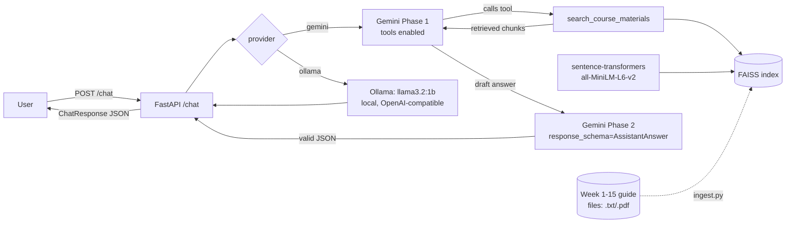

# Fusemachines Course Assistant (Task 1 — Applied AI)

A RAG-powered AI assistant that answers questions about the Fusemachines AI Fellowship's
own course materials (Weeks 1–15), with tool calling, structured JSON output, and a
choice of two LLM providers: **Gemini** (cloud) and **Llama 3.2** served locally.

## Architecture



**Prompt engineering.** `SYSTEM_INSTRUCTION` (in `app/llm_client.py`) explicitly instructs
the model to *always* call `search_course_materials` before answering course-content
questions rather than answering from memory, and to be honest (`escalate_to_human`) when
the answer isn't in the materials — this is what produces the "I couldn't find anything
about FAISS in the course materials" behavior rather than a hallucinated answer. Defaults
are `temperature=0.4` (low-ish on purpose: this is a factual lookup assistant, not a
creative one, so we want consistent, grounded answers over varied phrasing) and
`top_p=0.9` (a permissive-but-bounded default, left alone since low temperature already
constrains variance). Both are overridable per-request via `ChatRequest`.

**Retrieval is hybrid keyword+semantic, not pure semantic.** Pure cosine-similarity
search turned out to be unreliable for a very natural query pattern for this corpus:
"What does Week 14 say about X?" could retrieve zero Week 14 chunks, because an 800-char
chunk's embedding is dominated by its body text, and the week number isn't necessarily
repeated near every passage. `extract_week_filter()` in `app/rag.py` detects an explicit
"Week N" mention in the query and restricts semantic ranking to that week's chunks only,
falling back to normal corpus-wide search if no week is named (or the named week doesn't
exist, so the assistant can still honestly say "not found" rather than returning
nothing). This was found by testing, not assumed — see the exact before/after retrieval
output in this repo's development history.

**Why two Gemini calls instead of one?** Gemini's tool-calling protocol and its forced-JSON
`response_schema` mode don't compose reliably in a single call. Phase 1 runs with tools
enabled (the SDK's *automatic function calling* handles the tool-call loop for us) and
returns a free-text answer. Phase 2 asks the model to repackage that answer into the
`AssistantAnswer` schema (`answer`, `sources`, `escalate_to_human`) with tools disabled.
This guarantees valid JSON on every response while still allowing full tool use.

**Why is retrieval a *tool* instead of always running first?** `search_course_materials`
is exposed to the model as a callable tool rather than always being run before every
prompt. This is "agentic RAG": the model decides whether a question needs course-material
lookup at all (e.g. small talk doesn't), which is both more efficient and satisfies the
Tool Calling requirement using the same code path as the RAG requirement.

## Local Deployment: Ollama instead of vLLM

The assignment names vLLM as the example local-serving tool. vLLM is built for
GPU-accelerated batch serving and has no practical CPU story; this machine has no NVIDIA
GPU. **Ollama** is the standard substitute for local, CPU-friendly LLM serving — it
exposes the same "local open-source model behind an HTTP API" capability the assignment
is testing for, just via a different, GPU-independent server. `llama3.2:1b` was chosen
over a larger model for a reasonable memory/latency footprint on typical laptop hardware.

## Setup

1. **Prerequisites**: a Gemini API key in `.env` (see `../​.env` — one level up, shared by
   both tasks) and Ollama running locally with the model pulled:
   ```bash
   ollama pull llama3.2:1b
   ```
2. **Install & build the index** (first time, or whenever `data/corpus/` changes):
   ```bash
   pip install -r requirements.txt
   python ingest.py
   ```
3. **Run**:
   ```bash
   uvicorn app.main:app --reload --port 8000
   ```

## API

- `GET /health` → `{"status": "ok", "chunks_indexed": <n>}`
- `POST /chat`
  ```json
  {"message": "What models does Week 14 use?", "provider": "gemini", "temperature": 0.4, "top_p": 0.9}
  ```
  `provider` is `"gemini"` (default; RAG + tools + structured output) or `"ollama"` (local
  model, plain chat, no tools/RAG — a lighter-weight offline path).

## Docker

```bash
docker build -t course-assistant .
docker run -p 8000:8000 --env-file ../.env \
  --add-host=host.docker.internal:host-gateway \
  -e OLLAMA_HOST=http://host.docker.internal:11434 \
  course-assistant
```
Ollama runs on the host, not inside this container (containerizing Ollama + a model would
roughly double the image size for no real benefit) — `--add-host` lets the container reach
it. The FAISS index and embedding model are baked into the image at build time so the
container needs no network access except to reach Gemini.

## A networking note

This development environment blocks outbound IPv6 but still resolves IPv6 addresses for
external hosts, which makes some HTTP clients hang indefinitely trying IPv6 before ever
falling back to IPv4. `app/net.py` works around this for both the `requests`-based stack
(`huggingface_hub`/`sentence-transformers`, via a `socket.getaddrinfo` patch) and the
`httpx`-based stack (`google-genai`, via a client bound to the IPv4 wildcard address). This
is a no-op on networks where IPv6 works normally, so it's safe to leave in.

## Known limitations

- The corpus is a snapshot of guide files copied at build time; it won't reflect course
  material added afterward without re-running `ingest.py`.
- The Ollama path skips RAG/tools entirely — it's a lighter offline fallback, not a
  second full agent.
