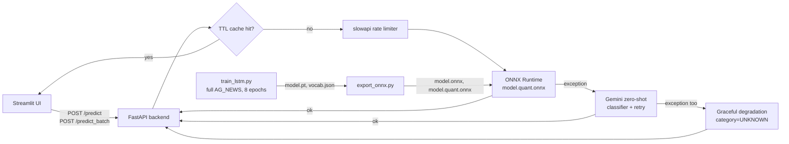

# AG_NEWS Topic Router — Productionized (Task 2 — Engineering AI Systems)

Takes the Week 13 from-scratch LSTM text classifier (previously a 5,000-row teaching
toy, ~30% accuracy) and turns it into a real, deployable service: retrained on the full
AG_NEWS dataset, ONNX-optimized, served behind a FastAPI backend with caching, retries,
rate limiting, and a Gemini fallback, plus a Streamlit UI.

## Architecture



## Model: retrained, not reused as-is

Week 13's original model was a 5,000-row subset, 3 epochs, never saved to disk — a
teaching toy, not something worth productionizing. `train/train_lstm.py` retrains the
same architecture on the **full** 120K-row training split with a frequency-filtered
30K-word vocabulary (instead of every hapax legomenon) and **gradient clipping**, which
turned out to matter a lot: the first full-data run (no clipping) plateaued near chance
accuracy for 3 epochs before an unstable late jump to 50%; adding `clip_grad_norm_`
fixed the instability outright — accuracy hit 88% by epoch 2.

**Final measured result: 90.5% test accuracy** (`artifacts/metrics.json`), a real result
worth deploying, not a toy number.

## Model optimization: ONNX + quantization

`train/export_onnx.py` exports the trained model, verifies numerical parity against
PyTorch, and applies dynamic int8 quantization. Measured on this machine:

| | Size | Latency (batch=1) |
|---|---|---|
| PyTorch (eager) | — | 9.49 ms |
| ONNX (fp32) | 8.1 MB | 0.95 ms |
| **ONNX (int8, used in production)** | **2.0 MB** | **0.18 ms** |

The production backend ships **only** `onnxruntime` — no PyTorch — keeping the
container lean; PyTorch stays confined to `train/`, which never ships.

## Reliability & performance engineering

- **Caching**: in-memory TTL cache keyed on normalized input text (`backend/cache.py`).
- **Async/concurrent handling**: inference runs in a thread-pool executor so the FastAPI
  event loop isn't blocked; `/predict_batch` runs one batched ONNX forward pass instead
  of N sequential calls. Measured: 40 concurrent `/predict` requests completed in 0.12s
  wall-clock (~330 req/s, 77-114ms per-request latency under load) — verified with a
  real `asyncio.gather` load test, not just inspection.
- **Rate limiting**: `slowapi`, configurable via `RATE_LIMIT` (default `30/minute`).
  Verified two ways: a dedicated test (`RATE_LIMIT=3/minute`, requests 1-3 → 200,
  requests 4-5 → 429) and organically during the concurrency test above, where the
  40-request burst produced a genuine mix of `200`/`429` responses.
- **Retry**: the Gemini fallback call retries with exponential backoff (`tenacity`).
  Verified with a mocked client that fails twice then succeeds — confirmed 3 real
  attempts before returning the correct result, not just that the decorator is present.
- **Fallback model/provider**: if the local ONNX model raises, requests fall back to
  Gemini doing zero-shot classification with the same 4-class schema — a genuinely
  different underlying model, not a retry of the same one. Verified by injecting a
  broken model object and confirming the response comes back correctly classified with
  `provider_used: "gemini_fallback"`.
- **Graceful degradation**: if *both* the local model and the Gemini fallback fail, the
  API still returns `200` with `category: "UNKNOWN"` rather than a 500. Verified by
  breaking both paths simultaneously.

**Known limitation**: the TTL cache is per-process/in-memory — scaling to multiple
backend replicas would need a shared cache (e.g. Redis) instead.

## Running locally

```bash
cd task2_productionize_router
python train/train_lstm.py      # ~40-65 min on CPU; produces artifacts/model.pt, vocab.json
python train/export_onnx.py     # produces artifacts/model.onnx, model.quant.onnx
pip install -r backend/requirements.txt -r frontend/requirements.txt
uvicorn backend.main:app --port 8000 &
BACKEND_URL=http://localhost:8000 streamlit run frontend/streamlit_app.py
```

## Docker

```bash
docker compose up --build
```
Backend on :8000, UI on :8501. `GEMINI_API_KEY` is read from `../.env` (shared with
Task 1) via `env_file` in `docker-compose.yml`.

## Deployment (bonus: cloud)

Not deployed (no cloud account provisioned for this project), but the path for any of
the three major providers is the same shape once an image registry is available:

```bash
# Example: Google Cloud Run (same idea applies to Azure Container Apps / AWS App Runner)
gcloud builds submit --tag gcr.io/PROJECT/router-backend -f Dockerfile.backend .
gcloud run deploy router-backend --image gcr.io/PROJECT/router-backend --set-env-vars GEMINI_API_KEY=...
# repeat for the frontend, pointing BACKEND_URL at the deployed backend's URL
```
