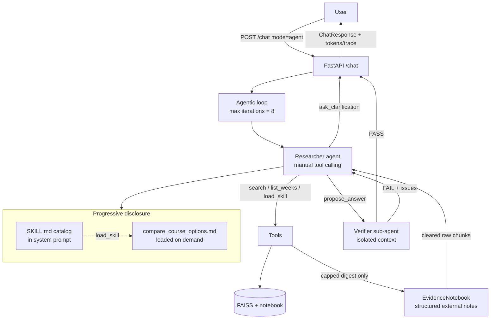

# Fusemachines Course Assistant (Task 1 — Applied AI + W16 Agentic Loop)

A RAG-powered AI assistant that answers questions about the Fusemachines AI Fellowship's
own course materials, now extended with an **explicit agentic loop**: a Researcher agent
that decides the next tool call from intermediate evidence, plus a Verifier sub-agent that
checks grounding before the answer is returned.

**Chosen agentic feature — cross-source verification with self-check.**  
A fixed search→answer pipeline is not sufficient because whether the first retrieval is
enough (wrong week, thin hits, missing side of a comparison) is only knowable after
inspecting intermediate results — the model must decide to search again, load a skill,
ask for clarification, or escalate.

## Architecture (W16)



Legacy W15 path (`mode=legacy`) still uses Gemini automatic function calling + JSON
packaging. Ollama remains a plain local chat fallback without tools.

---

## W16 Documentation (assessment)

### a. Context Engineering Technique

**Technique: structured external notes + clearing/capping tool results** (with progressive
skill disclosure as a secondary technique).

**Where in the loop:** Every `search_course_materials` hit list is capped (top 4), truncated
to short excerpts, and appended to an `EvidenceNotebook` living *outside* the chat
history (`app/agent/notes.py`). The tool response returned into Gemini is only a short
digest/pointer — prior raw FAISS blobs are not re-fed on later turns. Separately,
`SKILL.md` stays as a one-screen catalog in the Researcher system prompt; full comparison
instructions load only via `load_skill`.

**Problem solved:** Multi-iteration research was saturating context with repeated 800-char
chunks, which both raised token cost and buried the decision signal (“is evidence enough?”).
Clearing raw tool results into a bounded notebook keeps the Researcher’s context focused
on *what we know so far*, and gives the Verifier a compact packet without the full
tool-call transcript (context isolation).

### b. Agentic Pattern

**Multi-agent system:** Researcher (tool loop) + Verifier (grounding check).

**Why:** A single agent checking its own draft hits the **self-verification paradox** —
the same context that produced an unsupported claim is biased to accept it. Splitting
verification into a second agent with **context isolation** (question + proposal +
notebook only) and **specialization** (no search tools, pass/fail JSON only) addresses
that failure mode. We did *not* need parallelization here; coordination cost shows up in
tokens (see eval). A single-agent baseline (`single_agent=true`) remains available for
comparison and is acceptable for simple lookups, but the default path keeps the Verifier
because unsupported answers are worse than a little extra latency for this assistant.

### c. Evaluation Harness

Built from scratch under `eval/` (no third-party eval framework).

```bash
cd task1_ai_assistant
python -m eval.harness
# → eval/results/report.md  and  eval/results/results.json
```

Measures per query: **task completion**, **tool-call correctness** (expected tools +
non-empty args), **trajectory length**, **token totals** (with multi- vs single-agent
Δ on the Week 14 lookup pair), and a **failure log** tagged `hard` / `soft` /
`cascading_soft`. Includes intentional **failure injection** cases
(`tool_unavailable`, `malformed_retrieval`).

### Additional requirements

1. **Skill vs agent.** The Verifier *could* have been a Skill (static “check claims
   against notes” checklist). A Skill would not give a separate context window or an
   independent structured pass/fail, so we kept it as a sub-agent for isolation; the
   comparison playbook *is* a Skill (`load_skill`) because it is procedural guidance,
   not a stateful role.

2. **Token / cost accounting.** Each Gemini call records `usage_metadata` into a
   `TokenLedger` (`tokens` on `ChatResponse` / eval rows). The harness prints multi-agent
   vs single-agent totals for the same lookup query.

3. **Failure injection.** `inject_failure=tool_unavailable|malformed_retrieval` on
   `/chat` or via eval cases. Expected behavior: recognize the failure, escalate or ask
   for clarification — **not** a confident answer from memory. See the eval report’s
   failure-injection section.

4. **Tool vs agent boundary.** The FAISS RAG index is modeled as a **bounded tool call**:
   stateless `query → capped snippets`, no dialogue with the retriever. We did not wrap
   retrieval as agent-to-agent because it has no goals, memory, or branching policy of its
   own — only the Researcher needs those. The Verifier *is* agent-to-agent because it
   makes a judgment that feeds the next Researcher turn.

---

## Prompt / loop behavior

Researcher tools: `search_course_materials`, `list_available_weeks`, `load_skill`,
`ask_clarification`, `propose_answer`. Stopping conditions: verifier PASS, clarification,
max verify failures (2), or **max iterations (8)** — the loop cannot run forever.

Defaults: `temperature=0.4`, `top_p=0.9` (factual assistant). Hybrid week-filtered
retrieval from W15 is unchanged (`app/rag.py`).

## Setup

1. **Prerequisites**: Gemini API key in `../.env` and optional Ollama:
   ```bash
   ollama pull llama3.2:1b
   ```
2. **Install & index**:
   ```bash
   pip install -r requirements.txt
   python ingest.py
   ```
3. **Run**:
   ```bash
   uvicorn app.main:app --reload --port 8000
   ```

## API

- `GET /health`
- `POST /chat`
  ```json
  {
    "message": "Compare Week 10 and Week 11 CV projects and recommend one.",
    "provider": "gemini",
    "mode": "agent",
    "temperature": 0.4,
    "top_p": 0.9
  }
  ```
  - `mode`: `"agent"` (default, W16 loop) or `"legacy"` (W15 two-phase).
  - `single_agent`: skip Verifier (baseline).
  - `inject_failure`: `"tool_unavailable"` | `"malformed_retrieval"` (eval/demo).
  - Response adds `iterations`, `stopped_reason`, `tokens`, `tool_log`, `trace`.

## Docker

```bash
docker build -t course-assistant .
docker run -p 8000:8000 --env-file ../.env \
  --add-host=host.docker.internal:host-gateway \
  -e OLLAMA_HOST=http://host.docker.internal:11434 \
  course-assistant
```

## Networking note

Outbound IPv6 is broken in this environment; `app/net.py` forces IPv4 for
`sentence-transformers` and `google-genai` (see W15 notes). Safe no-op elsewhere.

## Known limitations

- Corpus is a snapshot; re-run `ingest.py` after adding guides.
- Ollama path still skips RAG/tools.
- Verifier adds latency/tokens; use `single_agent` only when comparing cost.
